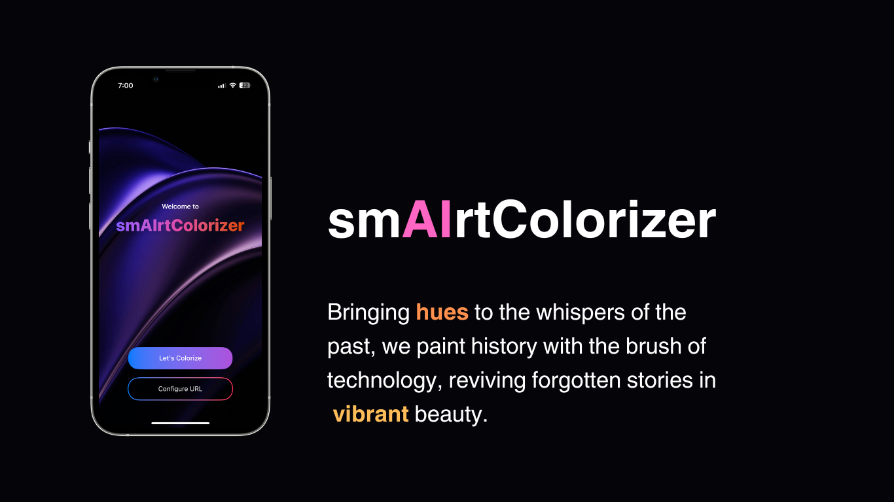
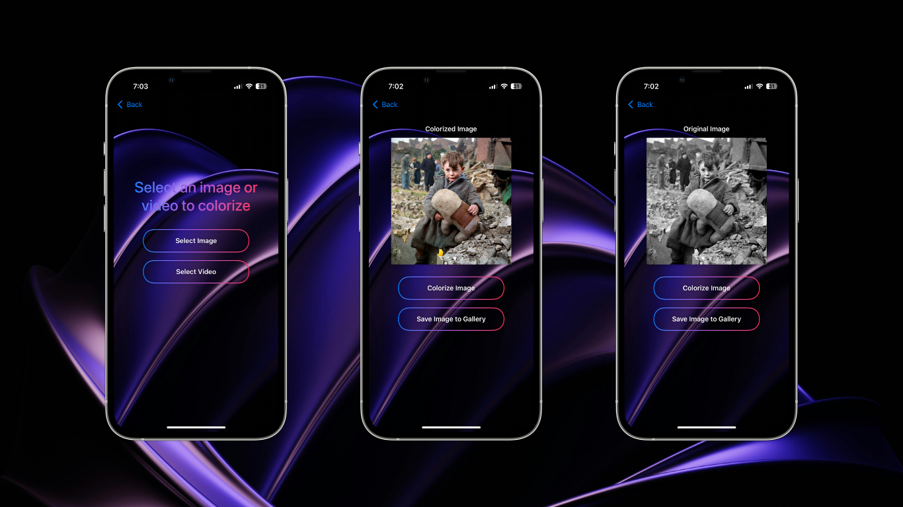

# 🪄🌈 smAIrtColorizer

This project provides an end-to-end pipeline for image and video colorization using a deep learning model. The backend is implemented in Python with Flask, while the frontend is built using Swift for iOS.



## Table of Contents
- [Features](#features)
- [Requirements](#requirements)
- [Setup](#setup)
- [Usage](#usage)
  - [Running the Backend](#running-the-backend)
  - [Running the iOS App](#running-the-ios-app)
- [Citation](#citation)
- [Acknowledgments](#acknowledgments)

---

## Features
- Colorize grayscale images and videos.
- Support for batch processing of images in a directory.
- iOS app for user-friendly interaction.
- GPU acceleration for faster processing.



---

## Requirements

### Backend
- Python 3.8+
- CUDA-compatible GPU (optional for faster processing)
- Required Python libraries (see `backend/requirements.txt`):
  - Flask
  - OpenCV
  - PyTorch
  - NumPy
  - tqdm
  - scikit-image

### iOS App
- Xcode 14+
- Swift 5.0
- iOS 15.0+

---

## Setup

### Backend
1. Clone the repository:
   ```bash
   git clone <repository-url>
   cd <repository-folder>/backend

2. Install the required Python libraries:
    ```bash
    pip install -r requirements.txt

3. Download the pre-trained model from the [DDColor repository](https://github.com/piddnad/DDColor) and place it in the `backend` directory. Rename the model file to `path_to_you_model.pt` or update the `MODEL_PATH` in `backend/app.py` accordingly.

4. Ensure you have a CUDA-compatible GPU if you want to use GPU acceleration.

---

### iOS App
1. Open the `ImageColorizer.xcodeproj` file in Xcode.

2. Set up your development team in the project settings for code signing.

3. Build and run the app on a simulator or a physical device.

---

## Usage

### Running the Backend
1. Start the Flask server:
   ```bash
   python app.py
   ```

2. The server will start:
 You can use the following endpoints:
   - `/process_image`: Upload a grayscale image to colorize.
   - `/process_video`: Upload a grayscale video to colorize.

### Running the iOS App
1. Launch the app on your iOS device or simulator.
2. Use the app to upload grayscale images or videos and view the colorized results.

---

## Citation
If you use this project, please cite the original model repository:

```
@misc{ddcolor,
  author = {Piddnad},
  title = {DDColor: Deep Learning for Image Colorization},
  year = {2023},
  publisher = {GitHub},
  journal = {GitHub repository},
  howpublished = {\url{https://github.com/piddnad/DDColor}}
}
```

---

## Acknowledgments
This project uses the DDColor model from the [DDColor repository](https://github.com/piddnad/DDColor). Special thanks to the authors for providing the pre-trained model and architecture.

